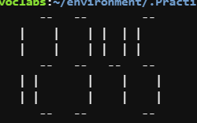

# LCD Display Simulator (JavaScript)

This project simulates a 7-segment LCD display using JavaScript. It generates scalable ASCII representations of numeric input, following the same logical structure used in real LCD displays.

## Features

- Scalable digit rendering
- Modular function design
- Structured segment representation
- Input validation
- Console-based visualization

## Technologies

- JavaScript
- Node.js

## Example

Input:

lcd(2, 12345)

## Example Output

## Author

Luis Alejandro Olvera Hernández
